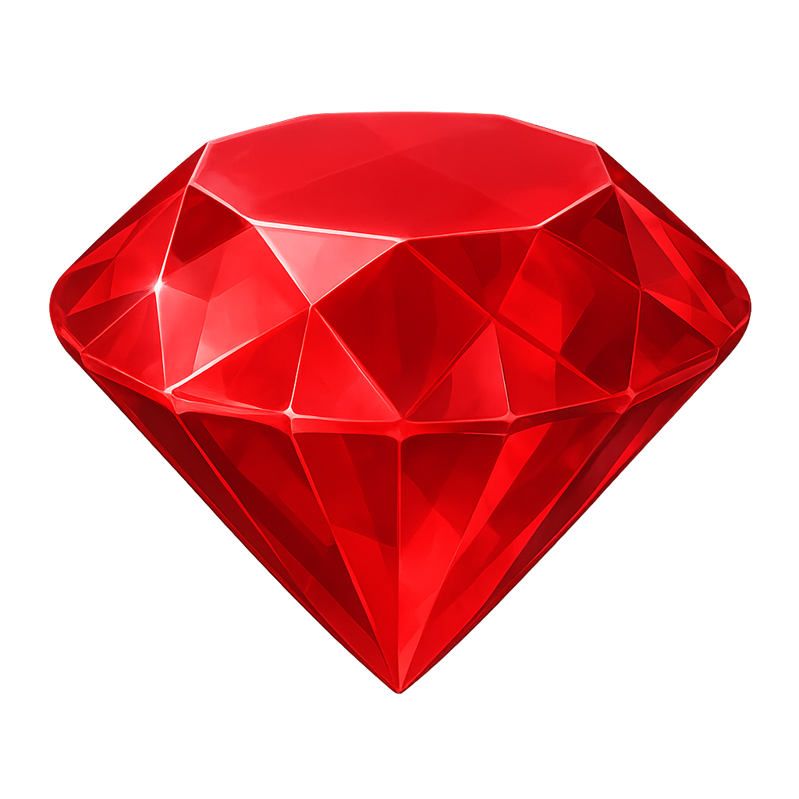
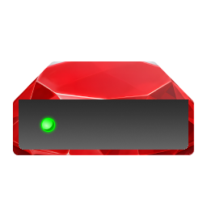

# Assets
Assets used for RubieLabs' repositories. This repository mainly contains icons but may also include useful code snippets at later dates.

## Table of Contents
- [Table of Contents](#table-of-contents)
- [Rubie Icons](#rubie-icons-rubie_)
  - [512x512](#512x512)
  - [1024x1024](#1024x1024)
  - [4096x4096](#4096x4096)
- [RubieDrive](#rubiedrive)

## [Rubie Icons (rubie_*)](https://github.com/RubieLabs)
Each image is scaled down in Markdown (not in the original PNGs). Additionally, the 4096x4096 image sometimes may not load in Markdown.

### 512x512

### 1024x1024

### 4096x4096

## [RubieDrive](https://github.com/RubieLabs/RubieDrive)
This icon is available in only one resolution.

